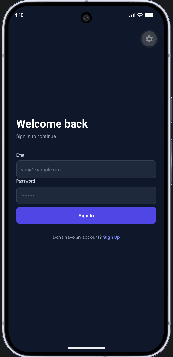

# Quiz Assessment — Frontend

React Native app for the Quiz / Assessment platform, built with **Expo + NativeWind (Tailwind CSS)**.

---

## Features

- Admin: create quizzes, add MCQ questions, toggle active/inactive, view submissions
- User: browse quizzes, attempt one question at a time with a live countdown timer
- Auto-submit when timer runs out (answered questions counted, rest marked -1)
- Re-attempt prevention handled gracefully
- Attempt history with score summary stats
- Dark UI with NativeWind — zero third-party UI kits

---

## Tech Stack

- React Native (Expo ~50)
- NativeWind v2 (Tailwind CSS for React Native)
- React Navigation (Native Stack)
- AsyncStorage (token persistence)

---

## Project Structure

```
quiz-frontend/
│
├── App.js
├── index.js     # Entry point 
├── package.json
├── package-lock.json
├── babel.config.js
├── metro.config.js
├── tailwind.config.js
├── global.css
├── .gitignore
├── .env
├── README.md
│
├── assets/
│
src/
├── config/
│   └── api.js              # API base URL — change this to switch environments
├── context/
│   └── AuthContext.jsx     # Global auth state, token storage, authFetch helper
├── navigation/
│   ├── AppNavigator.jsx    # Root navigator — routes based on role
│   ├── AdminNavigator.jsx  # Admin screen stack
│   └── UserNavigator.jsx   # User screen stack
└── screens/
    ├── auth/
    │   ├── LoginScreen.jsx
    │   └── RegisterScreen.jsx
    ├── admin/
    │   ├── AdminDashboard.jsx       # Quiz list + manage
    │   ├── CreateQuizScreen.jsx
    │   ├── AddQuestionScreen.jsx
    │   └── QuizSubmissionsScreen.jsx
    └── user/
        ├── QuizListScreen.jsx
        ├── AttemptQuizScreen.jsx    # One question at a time + timer
        ├── ResultScreen.jsx
        └── HistoryScreen.jsx
```

---

## Setup & Installation

```bash
# 1. Clone the repo
git clone <your-frontend-repo-url>
cd quiz-frontend

# 2. Install dependencies
npm install

# 3. Set up the API base URL
# Open src/config/api.js and update API_BASE_URL:
#   - Emulator (Android): http://10.0.2.2:5000/api/v1
#   - Physical device: http://<your-machine-ip>:5000/api/v1
#   - iOS simulator: http://localhost:5000/api/v1

# 4. Start the app
npx expo start
```

---

## Environment Variables

This project uses `src/config/api.js` as the single config file for the API URL (`.env` support requires Expo config plugins; the config file is simpler for live integration).

See `.env.example` for reference.

---

## API Base URL Config

Open **`src/config/api.js`** and change the URL before running:

```js
// iOS simulator
export const API_BASE_URL = 'http://localhost:5000/api/v1';

// Android emulator
export const API_BASE_URL = 'http://10.0.2.2:5000/api/v1';

// Physical device (replace with your machine's local IP)
export const API_BASE_URL = 'http://192.168.1.10:5000/api/v1';
```

---

## Login Screen



## Screens Overview

### Auth
- **Login** — email + password, routes to admin or user dashboard based on role
- **Register** — name, email, password, role selector (User / Admin)

### Admin
- **Dashboard** — lists all quizzes with status, question count, action buttons
- **Create Quiz** — title, description, time limit
- **Add Questions** — question text + 4 options, tap an option to mark it correct
- **Submissions** — all user attempts for a quiz with scores

### User
- **Quiz List** — available (active) quizzes with time + question count
- **Attempt Quiz** — one question at a time, live countdown timer, auto-submit on timeout
- **Result** — score, percentage, grade label
- **History** — all past attempts with stats summary

---

## Auth Flow

- Token is stored in `AsyncStorage` after login/register
- Sent as `Authorization: Bearer <token>` on every API call via `authFetch` in `AuthContext`
- On app launch, stored token + user are rehydrated automatically
